Desempenho de modelos preditivos com PCA
================
Viviane Sanchez
2020-06-22

# Introdução

A Análise exploratória e modelagem da base de dados
[Carseats](https://www.rdocumentation.org/packages/ISLR/versions/1.2/topics/Carseats)
do pacote *ISLR* será feita com uma Análise de Componentes Principais
(PCA).

Os modelos utilizados serão:

  - Regressão Linear
  - Floresta aleatória

A variável de resposta é Advertising

Na comparação do desempenho dos modelos, serão utilizados os dados com e
sem a aplicação de PCA no pré-processamento.

O **objetivo** é análisar o ganho ou perda no desempenho considerando a
técnica de redução de dimensão.

# Pacotes

``` r
library(ISLR)
library(tidyverse)
library(tidymodels)
library(tidytext)
library(skimr)
library(ggrepel)
library(factoextra)
library(vip)
```

# Dados

``` r
carseats_raw <- ISLR::Carseats

skim(carseats_raw)
```

|                                                  |               |
| :----------------------------------------------- | :------------ |
| Name                                             | carseats\_raw |
| Number of rows                                   | 400           |
| Number of columns                                | 11            |
| \_\_\_\_\_\_\_\_\_\_\_\_\_\_\_\_\_\_\_\_\_\_\_   |               |
| Column type frequency:                           |               |
| factor                                           | 3             |
| numeric                                          | 8             |
| \_\_\_\_\_\_\_\_\_\_\_\_\_\_\_\_\_\_\_\_\_\_\_\_ |               |
| Group variables                                  | None          |

Data summary

**Variable type:
factor**

| skim\_variable | n\_missing | complete\_rate | ordered | n\_unique | top\_counts                |
| :------------- | ---------: | -------------: | :------ | --------: | :------------------------- |
| ShelveLoc      |          0 |              1 | FALSE   |         3 | Med: 219, Bad: 96, Goo: 85 |
| Urban          |          0 |              1 | FALSE   |         2 | Yes: 282, No: 118          |
| US             |          0 |              1 | FALSE   |         2 | Yes: 258, No: 142          |

**Variable type:
numeric**

| skim\_variable | n\_missing | complete\_rate |   mean |     sd | p0 |    p25 |    p50 |    p75 |   p100 | hist  |
| :------------- | ---------: | -------------: | -----: | -----: | -: | -----: | -----: | -----: | -----: | :---- |
| Sales          |          0 |              1 |   7.50 |   2.82 |  0 |   5.39 |   7.49 |   9.32 |  16.27 | ▁▆▇▃▁ |
| CompPrice      |          0 |              1 | 124.97 |  15.33 | 77 | 115.00 | 125.00 | 135.00 | 175.00 | ▁▅▇▃▁ |
| Income         |          0 |              1 |  68.66 |  27.99 | 21 |  42.75 |  69.00 |  91.00 | 120.00 | ▇▆▇▆▅ |
| Advertising    |          0 |              1 |   6.63 |   6.65 |  0 |   0.00 |   5.00 |  12.00 |  29.00 | ▇▃▃▁▁ |
| Population     |          0 |              1 | 264.84 | 147.38 | 10 | 139.00 | 272.00 | 398.50 | 509.00 | ▇▇▇▇▇ |
| Price          |          0 |              1 | 115.80 |  23.68 | 24 | 100.00 | 117.00 | 131.00 | 191.00 | ▁▂▇▆▁ |
| Age            |          0 |              1 |  53.32 |  16.20 | 25 |  39.75 |  54.50 |  66.00 |  80.00 | ▇▆▇▇▇ |
| Education      |          0 |              1 |  13.90 |   2.62 | 10 |  12.00 |  14.00 |  16.00 |  18.00 | ▇▇▃▇▇ |

``` r
?Carseats
```

\#Feature Engineering

Como não existem muitas variáveis na base, podemos criar algumas que
talvez possam contribuir para a modelagem. Antes disso, verifia-se se há
alguma relação entre elas;

``` r
carseats_raw %>% 
  ggplot(aes(x = Population, y = Sales, color = Urban)) +
  geom_point()
```

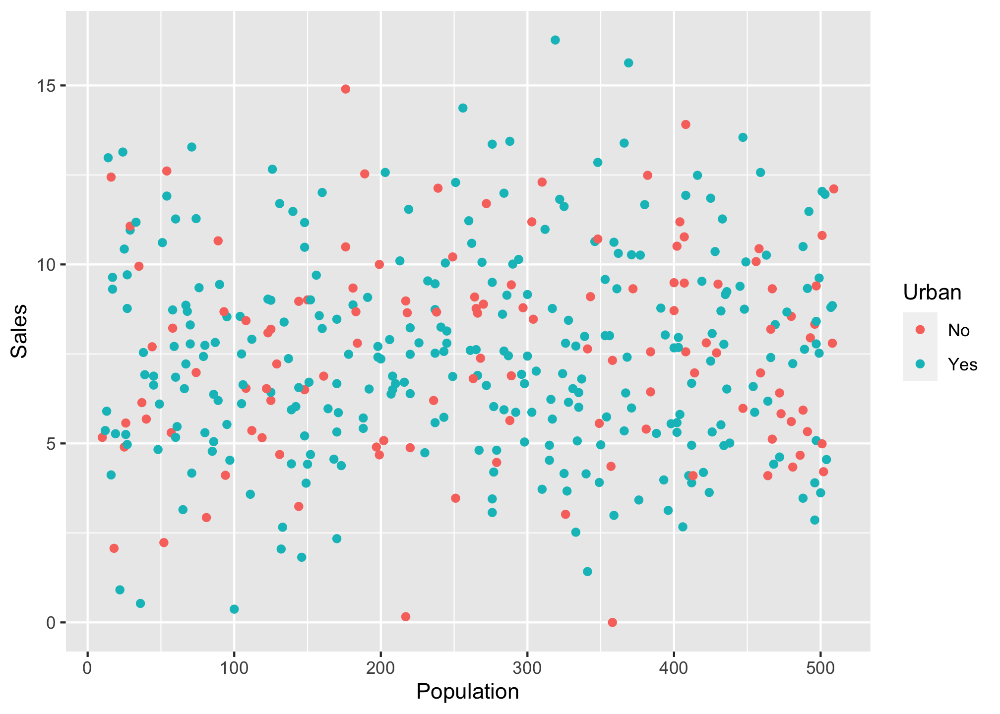

``` r
carseats_raw %>% 
  ggplot(aes(x = Population, y = Income, color = US)) +
  geom_point()
```

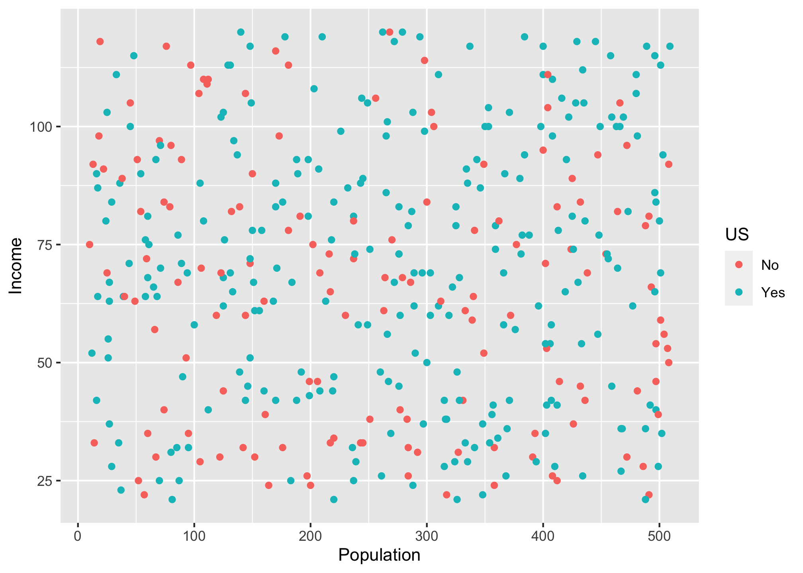

``` r
carseats_raw %>% 
  ggplot(aes(x = Price, y = CompPrice, color = US)) +
  geom_point()
```

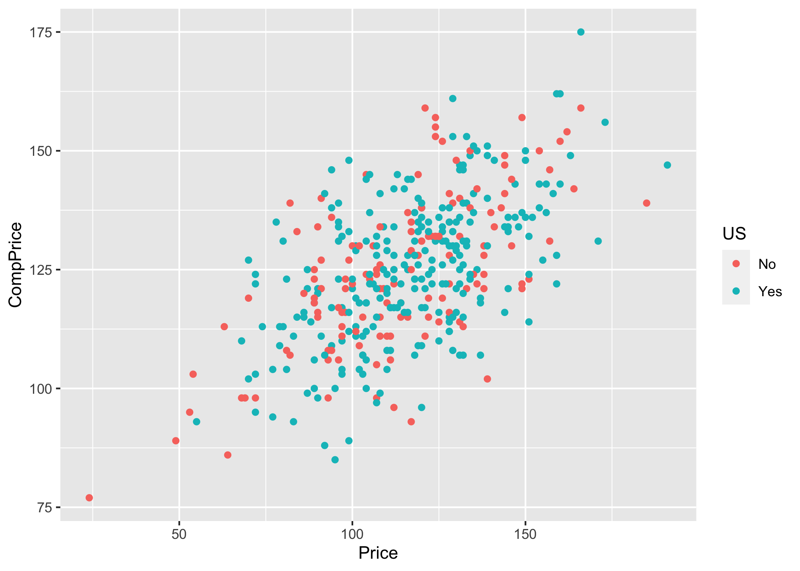

Aparentemente não existe uma relação direta entre o tamanho da população
e quantidade de vendas ou renda. O mesmo vale para o fato de lojas
estarem em local urbano ou nos Estados Unidos. Para o preço do
concorrente e preço do assento, nota-se uma correlação linear positiva.

``` r
carseats <- carseats_raw %>% 
  mutate(Inc_per_cap = Income/Population,
         Sales_per_cap = Sales/Population,
         Price_ratio = Price/CompPrice)
```

# Teste e Treino

Para iniciar a modelagem, a base é dividiada em treino (`train`) e teste
(`test`):

``` r
set.seed(123)

split <- initial_split(carseats, prop = 0.8, strata = Advertising) 

train <- training(split)
test <- testing(split)
```

# Pré-Processamento

Como serão utilizadas duas bases de treino difrentes para comparação,
são necessárias duas receitas para pré-processamento:

  - Com PCA

<!-- end list -->

``` r
cs_rec_pca <- recipe(Advertising ~ ., train) %>% 
  step_dummy(all_nominal(), -all_outcomes()) %>%
  step_normalize(all_numeric()) %>% 
  step_pca(all_predictors()) %>% 
  prep()

pca_train  <- juice(cs_rec_pca) 

pca_test <- bake(cs_rec_pca, new_data = test)
```

  - Sem PCA:

<!-- end list -->

``` r
cs_rec <- recipe(Advertising ~ ., train) %>% 
  step_dummy(all_nominal(), -all_outcomes()) %>%
  step_normalize(all_numeric()) %>% 
  prep()

cs_train  <- juice(cs_rec) 

cs_test <- bake(cs_rec, new_data = test)
```

# Análise de Componentes Principais

Da receita criada, são extraídas as contribuições individuais e
respectivos valores das componentes principais:

``` r
variance_pct <- cs_rec_pca$steps[[3]]$res

(cumsum(variance_pct$sdev^2) / sum(variance_pct$sdev^2))
```

    ##  [1] 0.1899105 0.3400357 0.4662258 0.5626880 0.6471294 0.7177678 0.7857103
    ##  [8] 0.8504712 0.9121653 0.9517845 0.9835618 0.9937362 0.9995404 1.0000000

``` r
fviz_eig(variance_pct, addlabels = TRUE) + 
  labs(x = "Componente Principal",
       y = "Percentual explicado da variância")
```

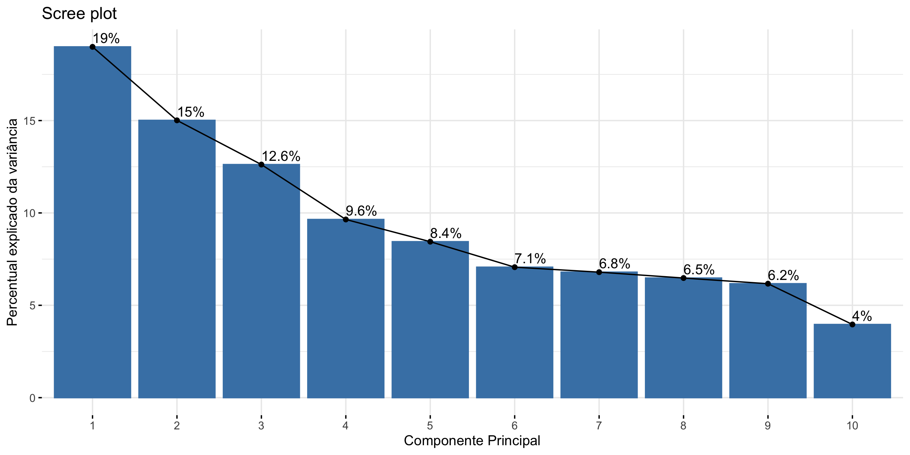

Observa-se que 65% da variância dos dados é explicada pelas 5 primeiras
componentes.

No gráfico a seguir, tem-se a contribuição individual das variáveis em
cada componente.

``` r
tidy_pca <- tidy(cs_rec_pca, 3)

tidy_pca %>% 
  mutate(component = fct_inorder(component)) %>%
  ggplot(aes(value, terms, fill = terms)) +
  geom_col(show.legend = FALSE) +
  facet_wrap(~component) +
  labs(y = NULL)
```

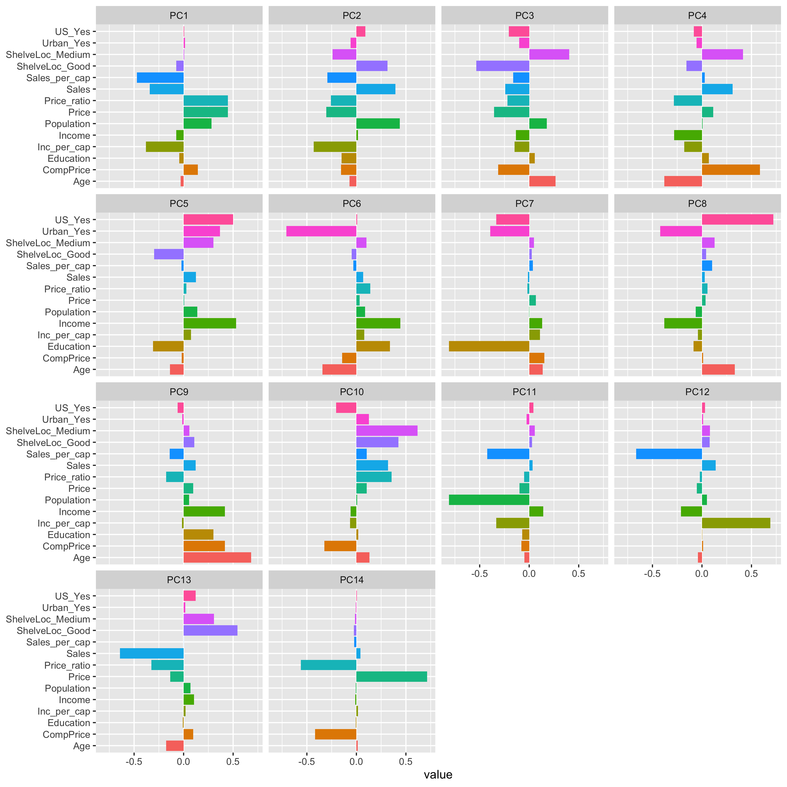

Inicialmente, verifica-se que as variáveis com maior contribiuição são
os indicadores per capita adicionados à base e localização na
prateleira.

Olhando as 5 primeiras componentes mais de perto, é possível ver melhor
o peso da contribuição de cada variável.

``` r
tidy_pca %>%
  filter(component %in% paste0("PC", 1:5)) %>%
  group_by(component) %>%
  top_n(8, abs(value)) %>%
  ungroup() %>%
  mutate(terms = reorder_within(terms, abs(value), component)) %>%
  ggplot(aes(abs(value), terms, fill = value > 0)) +
  geom_col() +
  facet_wrap(~component, scales = "free_y") +
  scale_y_reordered() +
  labs(
    x = "Valor absoluto da contribuição",
    y = NULL, fill = "Positiva?")
```

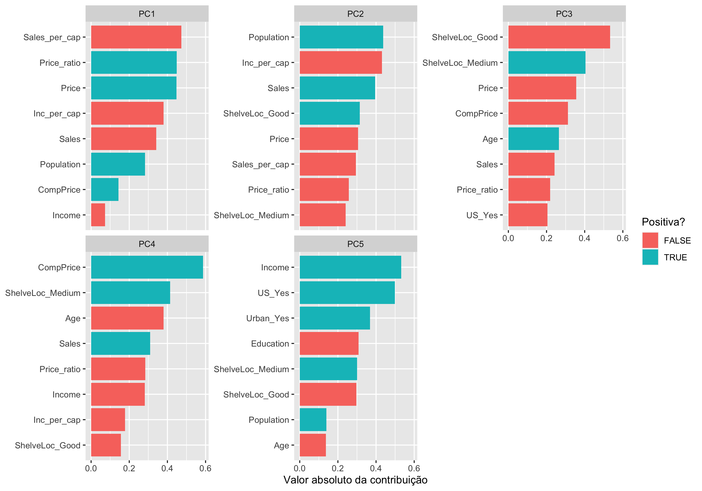

É comum utilizar as componentes principais como indicadores conforme as
variáveis mais importantes em cada uma. Nesse caso, pode-se separar as 5
primeiras nos respectivos indicadores: Vendas, População, Marketing,
Concorrência e Perfil do consumidor.

# Cross-Validation

Para melhor avaliar o desempenho dos modelos e ser possível compará-los,
as bases de treino são separada em 5 amostras de cross-validation:

``` r
set.seed(123)
(cv_splits_pca <- vfold_cv(pca_train, v = 5, strata = Advertising))
```

    ## #  5-fold cross-validation using stratification 
    ## # A tibble: 5 x 2
    ##   splits           id   
    ##   <list>           <chr>
    ## 1 <split [256/65]> Fold1
    ## 2 <split [257/64]> Fold2
    ## 3 <split [257/64]> Fold3
    ## 4 <split [257/64]> Fold4
    ## 5 <split [257/64]> Fold5

``` r
(cv_splits <- vfold_cv(cs_train, v = 5, strata = Advertising))
```

    ## #  5-fold cross-validation using stratification 
    ## # A tibble: 5 x 2
    ##   splits           id   
    ##   <list>           <chr>
    ## 1 <split [256/65]> Fold1
    ## 2 <split [257/64]> Fold2
    ## 3 <split [257/64]> Fold3
    ## 4 <split [257/64]> Fold4
    ## 5 <split [257/64]> Fold5

# Modelagem

## Regressão Linear

  - Com PCA

<!-- end list -->

``` r
lm_spec <- linear_reg() %>% 
  set_engine('lm')

#fit nos cv folds
lm_res_pca <- fit_resamples(lm_spec,
                            Advertising ~ .,
                            cv_splits_pca,
                            control = control_resamples(save_pred = TRUE))

lm_fit_pca <- lm_spec %>% 
      fit(Advertising ~.,
      data = pca_train)

lm_fit_pca %>% 
  tidy()
```

    ## # A tibble: 6 x 5
    ##   term         estimate std.error statistic  p.value
    ##   <chr>           <dbl>     <dbl>     <dbl>    <dbl>
    ## 1 (Intercept) -2.15e-16    0.0483 -4.44e-15 1.00e+ 0
    ## 2 PC1          3.30e- 2    0.0296  1.11e+ 0 2.67e- 1
    ## 3 PC2          1.52e- 1    0.0333  4.56e+ 0 7.35e- 6
    ## 4 PC3         -1.18e- 1    0.0364 -3.23e+ 0 1.35e- 3
    ## 5 PC4         -1.07e- 2    0.0416 -2.58e- 1 7.96e- 1
    ## 6 PC5          3.98e- 1    0.0445  8.96e+ 0 2.88e-17

  - Sem PCA

<!-- end list -->

``` r
lm_res <- fit_resamples(lm_spec,
                            Advertising ~ .,
                            cv_splits,
                            control = control_resamples(save_pred = TRUE))
  
lm_fit <- lm_spec %>% 
      fit(Advertising ~.,
      data = cs_train)

lm_fit %>% 
  tidy()
```

    ## # A tibble: 15 x 5
    ##    term              estimate std.error statistic  p.value
    ##    <chr>                <dbl>     <dbl>     <dbl>    <dbl>
    ##  1 (Intercept)      -3.37e-16    0.0341 -9.88e-15 1.00e+ 0
    ##  2 Sales             8.62e- 1    0.0831  1.04e+ 1 8.18e-22
    ##  3 CompPrice        -1.85e- 1    0.180  -1.02e+ 0 3.07e- 1
    ##  4 Income           -1.43e- 1    0.0406 -3.53e+ 0 4.76e- 4
    ##  5 Population        2.00e- 1    0.0449  4.44e+ 0 1.23e- 5
    ##  6 Price             2.88e- 1    0.305   9.42e- 1 3.47e- 1
    ##  7 Age               2.22e- 1    0.0407  5.45e+ 0 1.01e- 7
    ##  8 Education         4.85e- 2    0.0348  1.40e+ 0 1.64e- 1
    ##  9 Inc_per_cap       6.36e- 2    0.0670  9.50e- 1 3.43e- 1
    ## 10 Sales_per_cap     3.50e- 3    0.0663  5.28e- 2 9.58e- 1
    ## 11 Price_ratio       3.28e- 1    0.243   1.35e+ 0 1.78e- 1
    ## 12 ShelveLoc_Good   -5.89e- 1    0.0719 -8.20e+ 0 6.89e-15
    ## 13 ShelveLoc_Medium -2.57e- 1    0.0517 -4.98e+ 0 1.08e- 6
    ## 14 Urban_Yes         3.51e- 2    0.0346  1.01e+ 0 3.12e- 1
    ## 15 US_Yes            5.13e- 1    0.0376  1.36e+ 1 1.91e-33

### Importância das Variáveis

  - Com PCA

<!-- end list -->

``` r
vi(lm_fit_pca) %>% 
  mutate(Importance_pct = abs(Importance)/max(abs(Importance))) %>% 
  mutate(Variable = fct_reorder(Variable, Importance_pct)) %>% 
  filter(Importance_pct > 0.05) %>% 
  ggplot(aes(Variable, Importance_pct, fill = Sign)) +
  geom_col()+
  scale_y_continuous(labels = scales::percent_format())+
  coord_flip()
```

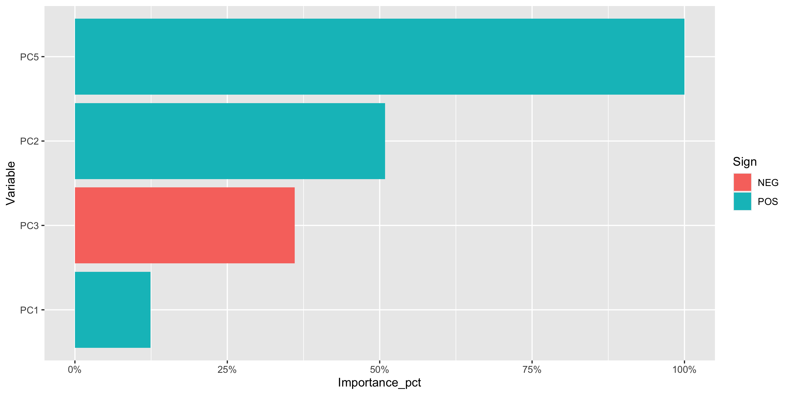

Na primeira regressão linear, observa-se que as componentes relacionadas
ao perfil do consumidor são as mais importantes.

``` r
variance_pct %>% 
      fviz_pca_var(axes = c(5,2), col.var="contrib", gradient.cols = c("#00AFBB", "#E7B800", "#FC4E07")) 
```

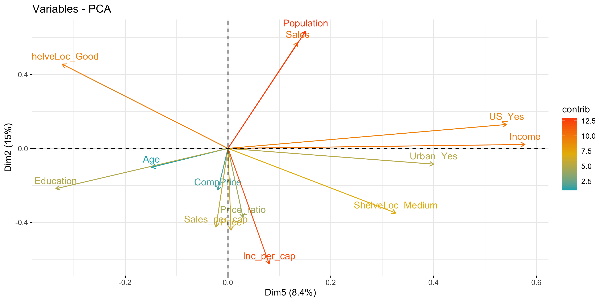

Olhando essas componentes mais de perto, nota-se um grande contraste
entre a qualidade da localização na prateleira (Boa vs Média), assim
como educação vs quantidade de vendas e renda per capita. Além disso, o
fato de a loja estar localizada nos EUA também tem se destaca, junto com
a renda total.

  - Sem PCA

<!-- end list -->

``` r
vi(lm_fit) %>% 
  
  mutate(Importance_pct = abs(Importance)/max(abs(Importance))) %>% 
  mutate(Variable = fct_reorder(Variable, Importance_pct)) %>% 
  filter(Importance_pct > 0.05) %>% 
  ggplot(aes(Variable, Importance_pct, fill = Sign)) +
  geom_col()+
  scale_y_continuous(labels = scales::percent_format())+
  coord_flip()
```

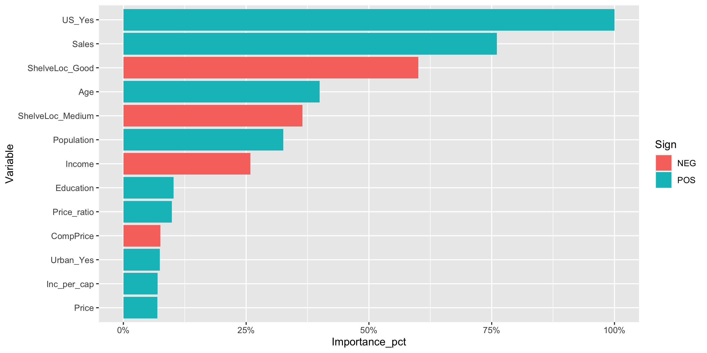

As variáveis que mais explicam o orçamento para propaganda
(`Advertising`) são o fato de a loja estar localizada nos EUA e a
quantidade de vendas.

## Floresta Aleatória

``` r
rf_spec <- rand_forest(mode = "regression",
                            mtry = 3, #p/3
                            trees = 1000) %>% 
                set_engine("ranger", importance = "permutation")
```

O mtry utilizado será 3, pois é um número que funciona tanto para a base
sem PCA (11/3) como para a base de componentes principais. Para
simplificar a análise, serão utilizadas 1000 árvores, que normalmente é
um número em que se obtém um bom desempenho sem overfitting.

  - Com PCA

<!-- end list -->

``` r
rf_res_pca <- fit_resamples(rf_spec,
                            Advertising ~ .,
                            cv_splits_pca,
                            control = control_resamples(save_pred = TRUE))


rf_fit_pca <- rf_spec %>% 
      fit(Advertising ~ .,
      data = pca_train)
```

  - Sem PCA

<!-- end list -->

``` r
rf_res <- fit_resamples(rf_spec,
                        Advertising ~ .,
                        cv_splits,
                        control = control_resamples(save_pred = TRUE))


rf_fit <- rf_spec %>% 
      fit(Advertising ~ .,
      data = cs_train)
```

### Importância das Variáveis

  - Com PCA

<!-- end list -->

``` r
vi(rf_fit_pca) %>% 
  mutate(Importance_pct = abs(Importance)/max(abs(Importance))) %>% 
  mutate(Variable = fct_reorder(Variable, Importance_pct)) %>% 
  filter(Importance_pct > 0.05) %>% 
  ggplot(aes(Variable, Importance_pct)) +
  geom_col()+
  scale_y_continuous(labels = scales::percent_format())+
  coord_flip()
```

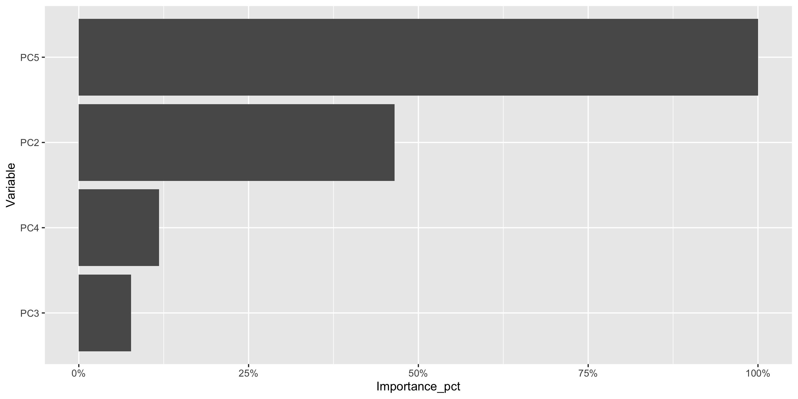

  - Sem PCA

<!-- end list -->

``` r
vi(rf_fit) %>% 
  mutate(Importance_pct = abs(Importance)/max(abs(Importance))) %>% 
  mutate(Variable = fct_reorder(Variable, Importance_pct)) %>% 
  filter(Importance_pct > 0.01) %>% 
  ggplot(aes(Variable, Importance_pct)) +
  geom_col()+
  scale_y_continuous(labels = scales::percent_format())+
  coord_flip()
```

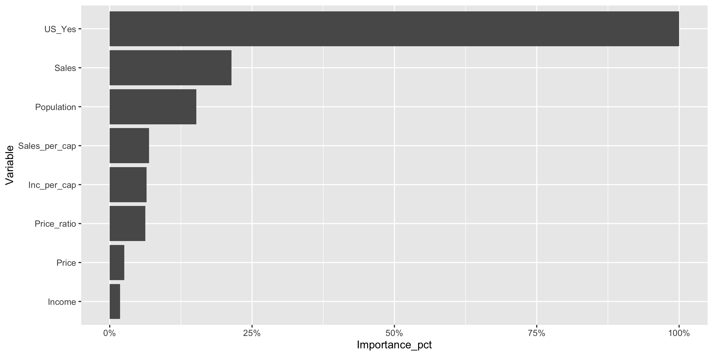

Em ambos os modelos, as variáveis mais importantes foram comuns às que
apareceram na regressão linear.

# Desempenho

## V-Folds

``` r
lm_res_pca %>% 
  select(id, .metrics) %>% 
  unnest(.metrics) %>% 
  mutate(model = "LM com PCA") %>% 
  bind_rows(lm_res %>% 
            select(id, .metrics) %>% 
            unnest(.metrics) %>% 
            mutate(model = "LM sem PCA")) %>% 
  bind_rows(rf_res_pca %>% 
            select(id, .metrics) %>% 
            unnest(.metrics) %>% 
            mutate(model = "RF com PCA")) %>% 
  bind_rows(rf_res %>% 
            select(id, .metrics) %>% 
            unnest(.metrics) %>% 
            mutate(model = "RF sem PCA")) %>% 
  ggplot(aes(id, .estimate, group = model, color = model)) + 
  geom_point(size = 1.5) + 
  facet_wrap(~.metric) + 
  coord_flip()
```

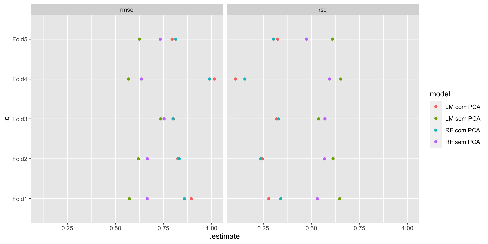

Pelo gráfico, observa-se que o erro é menor para a modelagem das
componentes principais. No entanto, o R2 é maior na modelagem sem PCA.
Isso é válido tanto para a regressão linear, como para a floresta
aleatória.

## Base Teste

``` r
results_test <- lm_fit_pca %>% 
  predict(new_data = pca_test) %>% 
  mutate(truth = pca_test$Advertising,
         model = 'LM com PCA') %>% 
  bind_rows(lm_fit %>% 
  predict(new_data = cs_test) %>% 
  mutate(truth = cs_test$Advertising,
         model = 'LM sem PCA')) %>% 
  bind_rows(rf_fit %>% 
  predict(new_data = cs_test) %>% 
  mutate(truth = cs_test$Advertising,
         model = 'RF sem PCA')) %>% 
   bind_rows(rf_fit_pca %>% 
  predict(new_data = pca_test) %>% 
  mutate(truth = pca_test$Advertising,
         model = 'RF com PCA'))
  
results_test %>% 
  group_by(model) %>% 
  rmse(truth = truth, estimate = .pred) %>% 
  arrange(desc(.estimate))
```

    ## # A tibble: 4 x 4
    ##   model      .metric .estimator .estimate
    ##   <chr>      <chr>   <chr>          <dbl>
    ## 1 RF com PCA rmse    standard       0.890
    ## 2 LM com PCA rmse    standard       0.819
    ## 3 RF sem PCA rmse    standard       0.585
    ## 4 LM sem PCA rmse    standard       0.566

Avaliando os resultados da base teste, nota-se o desempenho superior da
modelagem com PCA tanto para a Floresta Aleatória como para a Regressão
Linear.

# Conclusão

A inclusão da Análise de Componentes Principais (PCA) no
pré-processamento melhorou muito o desempenho dos modelos testados.
Além disso, é uma forma de explicar a variância dos dados antes de
qualquer modelagem, algo que pode ser muito útil num ambiente de negócio
que demanda agilidade nas análises para a tomada de decisões.

-----

# Referências

  - Material de aulas do curso Modelagem Preditiva Avançada

  - [An Introduction do Statistical Modelling - James, G. et.
    al.](http://faculty.marshall.usc.edu/gareth-james/ISL/ISLR%20Seventh%20Printing.pdf)

  - [The Elements of Statistical Learning - Hastie, T. et.
    al.](https://web.stanford.edu/~hastie/ElemStatLearn/printings/ESLII_print12.pdf)

  - Material de aula do curso Modelos Preditivos - Insper - 2020

  - Julia Silge
    
      - [PCA and the \#TidyTuesday best hip hop songs
        ever](https://juliasilge.com/blog/best-hip-hop/)
      - [PCA and UMAP with tidymodels and \#TidyTuesday cocktail
        recipes](https://juliasilge.com/blog/cocktail-recipes-umap/)

  - [Tidymodels documentation](https://tidymodels.github.io/tidymodels/)
